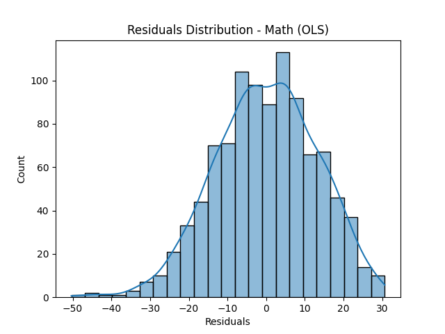
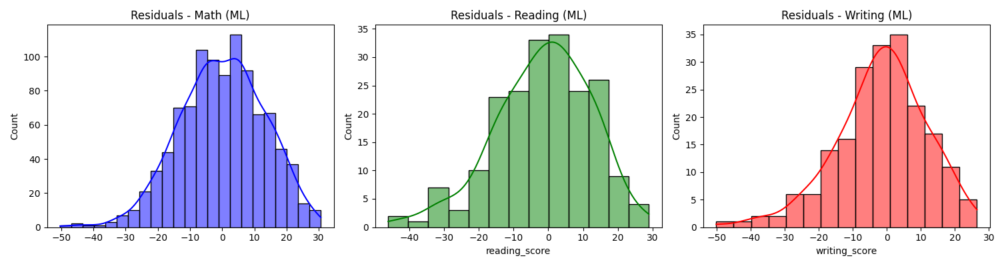
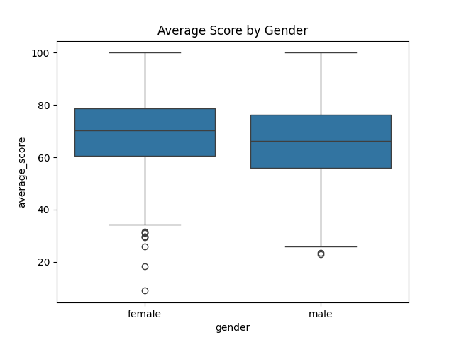
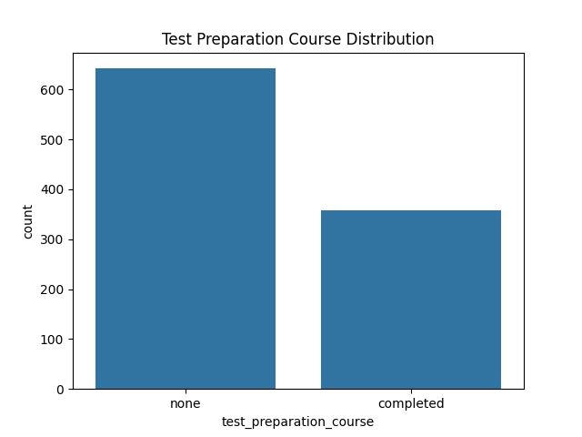

# 🎓Student Performance Predictor 

A machine learning and statistical analysis project designed to predict student performance and identify key factors influencing academic success.
This project uses both regression and classiifcation models,statistical tests,visualizations,and a Streamlit web app.


---

## 📂 Dataset Description

- Source: [Kaggle - Students Performance](https://www.kaggle.com/datasets/spscientist/students-performance-in-exams)
- Records: 1000 students
- Features:
  - Gender
  - Race/Ethnicity
  - Parental Level of Education
  - Lunch Type
  - Test Preparation Course
  - Math Score
  - Reading Score
  - Writing Score

---

## 📖 Project Objective

We built:
- A **multiple linear regression model** to predict scores.
- A **classification model** to identify **high-performing** students.
- A **Streamlit app** to allow users to input data and get predictions.

---

## ✨ Key Features

- 🔍 **EDA with visual insights**
- 📊 **Statistical tests** (t-tests, ANOVA)
- ⚙️ **Regression & Classification models** (Linear Regression, Random Forest, XGBoost)
- 🌐 **Interactive Streamlit app**
- ✅ Feature engineering: average score, high performance label
- 📉 Residual plots, model evaluation metrics

---


## 🛠️ Tech Stack

| Tool        | Purpose                        |
|-------------|--------------------------------|
| Python      | Data preprocessing, modeling   |
| Pandas, NumPy | Data manipulation             |
| Seaborn, Matplotlib | Visualization           |
| Scikit-learn | ML models                     |
| Statsmodels | OLS Regression, ANOVA, t-tests |
| Streamlit   | Web application                |

---


## 📊 EDA & Statistical Analysis

- Distribution of scores by gender and parental education
- Correlation matrix & pairplots
- **T-tests** for gender-based score differences
- **ANOVA** for categorical variables (e.g., race, lunch)
- Checked for multicollinearity using VIF

---

## 🤖 Modeling

### 🔷 Regression
- **OLS Regression** for predicting math score
- **MultiOutput Linear Regression** for predicting math, reading, and writing scores
- Metrics: R², RMSE, residual plots

### 🔶 Classification
- Created `average_score` and `high_performer` label (≥70 avg)
- Trained **Random Forest Classifier**
- Evaluated using Accuracy, Confusion Matrix, Precision, Recall

---

## 🚀 Streamlit Web App

The web app allows users to input:
- Gender, Parental Education, Lunch Type, Test Preparation, etc.

And outputs:
- Predicted math/reading/writing scores
- Classification as "High Performer" or "Needs Improvement"


## 📌 Run with:

```
streamlit run app/streamlit_app.py
```

## ▶️ How to Run
### 1.Clone the repo:
```
git clone https://github.com/your-username/students-performance.git
cd students-performance
```

### 2.Install dependencies:
```
pip install -r requirements.txt
```

### 3.Run the Streamlit app:
```
streamlit run app/streamlit_app.py
```

## 📌 Results & Conclusion
- Parental education and test preparation significantly impact performance.

- Students who completed test prep scored ~10–15% higher.

- Gender-based performance difference in reading/writing was statistically significant.

- Models performed with good accuracy and explainability.


## 📊 Output Graphs

Below are key visualizations that helped in understanding student performance and informed model building:

### 1. Score Distribution

#### Shows the distribution of math scores across students.



#### Shows the distribution of math, reading, and writing scores across students.




---

### 2. Boxplot - Gender vs Scores

Compares the scores across different genders.



---

### 3. Countplot - Test Preparation Course Completion 

Shows the count of students who completed the test preparation course vs. those who did not.




---


## ✅ Recommendation

Based on the exploratory data analysis and predictive modeling, here are key recommendations:

- **🔍 Academic Support**: Students whose parents have lower education levels may benefit from additional learning resources and counseling.
- **🥗 Lunch Quality Matters**: Standard lunch programs correlate with higher scores — schools should consider making nutritious lunches universally available.
- **📚 Test Preparation is Effective**: Students who completed a test preparation course performed better. Encourage widespread participation.
- **🧠 Predictive Risk Models**: Use the developed classification model to flag potentially low-performing students early and offer targeted interventions.
- **📈 Continuous Monitoring**: Integrate dashboards (like the Streamlit app) into school admin systems to track student performance trends live.

---


## 🔮 Future Work
- Add SHAP analysis for model interpretability

- Add a dashboard for better visual insights

- Deploy Streamlit app online using Streamlit Cloud

## 👩‍💻 Author
```
Vaishnavi Metkar
M.Sc. Statistics | Aspiring Data Analyst
📧 vaishanavimetkar2802@gmail.com
📎 GitHub: github.com/vaishnavimetkar
📎LinkedIn: linkedin.com/in/vaishnavimetkar
```

## 📁 File Structure
```
students-performance/
├── data/
│ └── dataset.csv
├── src/
│ └──project.py
├── app/
│ └── app.py
├── requirements.txt
├── README.md
├── graphs/
│ └──math_score_distribution_plot.png
│ └──all_score_distribution_plot.png
│ └──distribution_gender_plot.png
│ └──distribution_testprep_plot.png
```


---